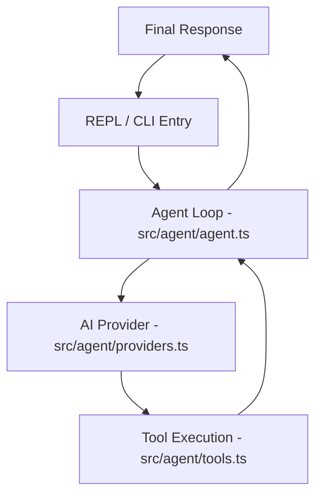

# Project Architecture: Lulu

Lulu is an autonomous AI agent designed for local development and repository interaction. This document outlines the system design and core flows.

## System Overview
Lulu operates on an agentic loop pattern. It doesn't just respond to prompts; it reasons about the environment and uses tools to achieve goals.

## Core Modules

### 1. API Server (`src/server.ts`)
A high-performance web server built with **Elysia** and **Bun**. It exposes endpoints for:
- `POST /prompt`: Trigger the AI agent.
- `GET /history`: Retrieve global conversation logs.

### 2. Entry Point (`src/index.ts`)
Handles CLI arguments and the interactive REPL. It manages `readline` history and initializes the configuration.

### 3. Configuration (`src/config.ts`)
Loads settings from environment variables and the global `~/.lulu/config.json`. It also handles **Project Memory** injection by detecting the current project name.

### 4. Agent Loop (`src/agent/agent.ts`)
The heartbeat of Lulu. It manages the conversation context and runs up to 10 rounds of tool execution per prompt. It automatically summarizes history when it exceeds 12 messages to preserve the context window.

### 5. Provider Layer (`src/agent/providers.ts`)
Normalizes communication between different AI providers (Anthropic, OpenAI, Google, etc.). Configurations for these providers are stored in `src/providers.json`.

### 6. Tool System (`src/agent/tools.ts`)
Implements capabilities like reading/writing files, running commands, and updating project memory. Tool schemas are defined in `src/agent/tools_schema.json`.

## Data Storage (`~/.lulu/`)
Lulu maintains state outside the repository to ensure persistence across sessions:
- `config.json`: Global user preferences.
- `history.jsonl`: Detailed interaction logs.
- `projects/[name]/memory.json`: Structured knowledge about specific codebases.

## Architectural Principles
- **JSON-First Configuration:** All internal metadata and schemas are stored as JSON for easy extensibility.
- **Stateless Agent:** The agent logic relies on the context passed in each turn, with memory provided via the system prompt.
- **Safety First:** Destructive operations require explicit permission via environment variables.
