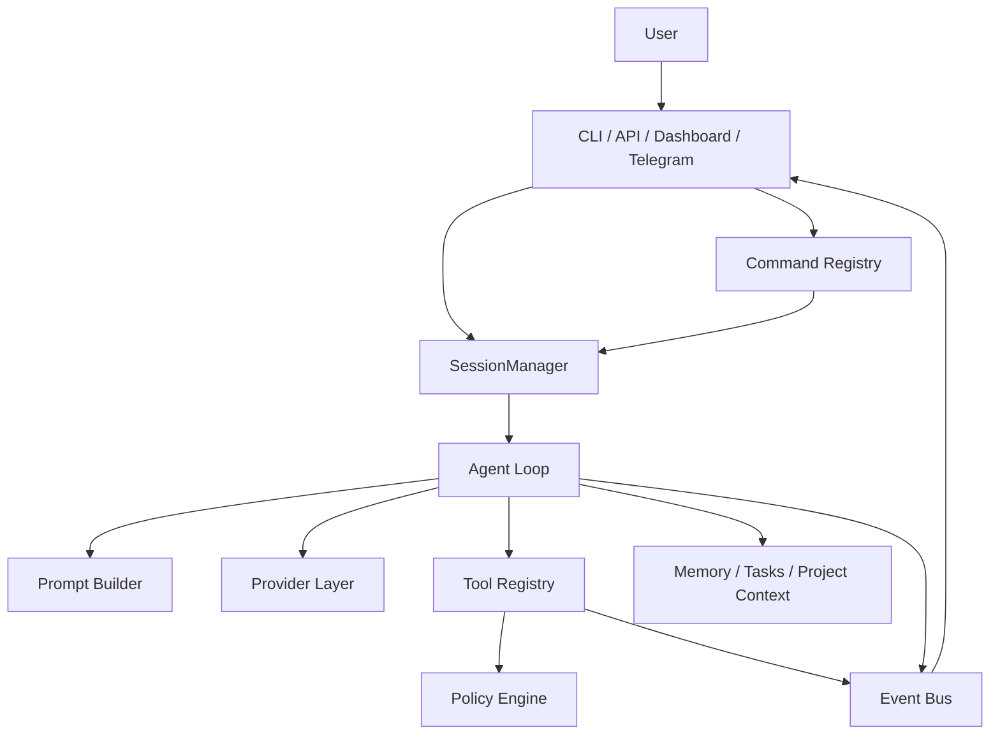

# Project Architecture: Lulu

Lulu is a local-first autonomous agent for development, repository work, and chat-based control surfaces such as CLI, API, dashboard, and Telegram.

## System Overview

Lulu follows an agent loop, but the loop is only one part of the runtime. Durable state, commands, tools, project context, and events are centralized so every channel behaves like the same agent instead of separate frontends.

## Core Modules

### Agent Loop (`src/core/agent.ts`)

Runs the provider/tool loop, streams events, summarizes long histories, reflects useful knowledge into memory, and writes session history.

### Session System (`src/core/session.ts`)

Central persistence for channel-specific conversations. CLI, API, dashboard, and Telegram should all address context through `SessionManager` instead of keeping isolated history structures.

Sessions track:
- channel and subject id
- project, provider, model
- message history
- created and updated timestamps
- metadata for channel-specific state

### Prompt System (`src/core/prompt.ts`)

Builds the system prompt from ordered layers: base prompt, profile prompt, project prompt, memory, skills, tasks, and other contextual modules.

### Command Registry (`src/core/commands.ts`)

Defines slash commands once and lets each channel call the same command implementation. This prevents `/status`, `/prompt`, `/project`, `/task`, `/reset`, and future commands from drifting across CLI, API, and Telegram.

### Project System (`src/core/project.ts`)

Describes the active project, root path, scripts, stack, and project-level configuration. This is the anchor that keeps sessions, memory, tools, tasks, and prompt context from mixing across repositories.

### Tool Registry (`src/tools/registry.ts`)

Registers tools from modules and exposes provider-compatible tool definitions. Tool execution goes through the policy layer before any action is performed.

### Policy, Security, Secrets, and Capabilities

- `src/core/policy.ts`: central allow/deny/approval decisions
- `src/core/security.ts`: filesystem and command safety checks
- `src/core/secrets.ts`: redaction and secret handling
- `src/core/capabilities.ts`: runtime feature detection such as git, bun, tmux, docker, and platform details

### Task System (`src/core/tasks.ts`)

Tracks longer-running work with ids, status, checklist items, logs, and project scope. Tasks should be visible from chat commands and dashboard surfaces.

### Event Bus (`src/core/events.ts`)

Publishes session, agent, token, tool, and error events. This is the bridge for live UI updates, Telegram notifications, and dashboard observability.

### Integrations

- `src/cli/index.ts` and `src/cli/index.tsx`: terminal entrypoints
- `src/api/server.ts`: HTTP and websocket API
- `src/integrations/telegram.ts`: Telegram chat gateway
- `dashboard/`: browser dashboard

## Data Storage (`~/.lulu/`)

Lulu stores durable user state outside the repository:

- `config.json`: global user preferences
- `sessions.json`: central session store
- `history.jsonl`: interaction history
- `projects/[name]/memory.json`: project memory
- task databases and other project-scoped runtime data

## Lessons From OpenClaw And Hermes Agent

The useful pattern is not copying another agent's surface area. It is turning repeated behavior into durable subsystems.

- **Multi-channel gateway:** Telegram, CLI, API, and dashboard must share sessions, commands, tools, and project state.
- **Persistent memory:** durable memory should be separate from chat history and scoped by project/user.
- **Skill growth:** solved workflows should become reusable skills or commands after review.
- **Scheduler and jobs:** unattended recurring work needs a task/job engine, not ad hoc prompts.
- **Sub-agents:** parallel work should run as isolated sessions with explicit project, tool, and terminal scope.
- **Sandboxed execution:** powerful local tools need policy, approvals, logging, and optional isolated backends.
- **Observable runtime:** every tool call, task transition, and agent error should emit events for chat and dashboard surfaces.

## Architectural Principles

- **Local-first:** user data and project state stay under `~/.lulu/` unless a configured provider or integration requires network access.
- **One runtime, many channels:** channels are transport layers; they should not own core behavior.
- **Project-scoped by default:** prompts, memory, tasks, tools, and sessions should resolve through the active project.
- **Policy before action:** shell, tmux, filesystem, network, and external integrations must pass a central permission check.
- **Inspectable growth:** memory, skills, tasks, and plugin state should be readable and reviewable by the user.
