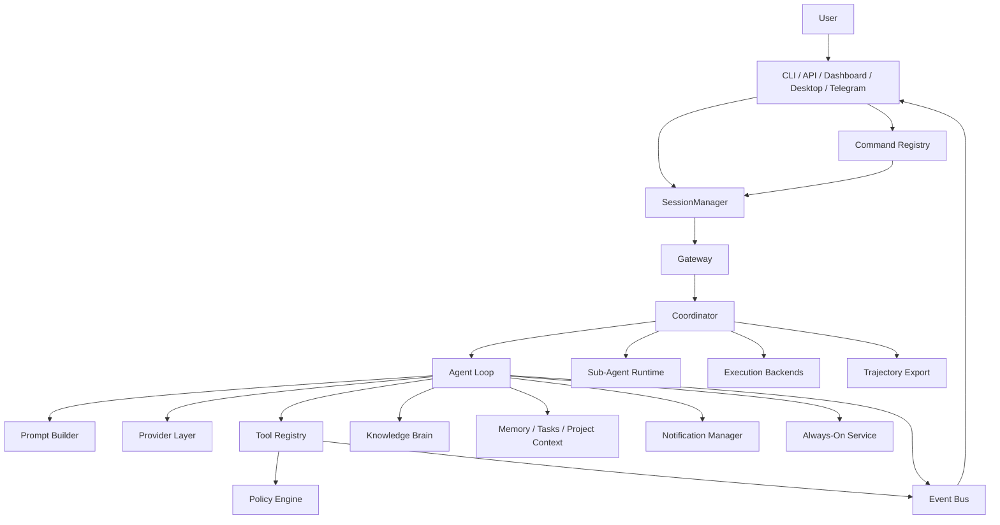

# Project Architecture: Lulu

Lulu is a local-first autonomous agent for development, repository work, and chat-based control surfaces such as CLI, API, dashboard, desktop, and Telegram.

## System Overview

Lulu follows an agent loop, but the loop is only one part of the runtime. Durable state, commands, tools, project context, and events are centralized so every channel behaves like the same agent instead of separate frontends.

## Core Modules

### Gateway (`src/core/gateway.ts`)

Central routing for API, dashboard, and Telegram. Handles channel resolution, session routing, queueing, command dispatch, agent execution, and message persistence.

### Agent Loop (`src/core/agent.ts`)

Runs the provider/tool loop, streams events, summarizes long histories, reflects useful knowledge into memory, and writes session history.

### Coordinator (`src/core/coordinator.ts`)

Task orchestration engine with dependency graph resolution. Routes complex tasks to sub-agents and coordinates multi-agent execution.

### Session System (`src/core/session.ts`)

Central persistence for channel-specific conversations. CLI, API, dashboard, desktop, and Telegram all address context through `SessionManager`.

Sessions track: channel, subject, project, provider, model, messages, turn count, created/updated timestamps, and metadata.

### Prompt System (`src/core/prompt.ts`)

Builds the system prompt from ordered layers: base prompt, profile prompt, project prompt, SOUL files, memory, skills, tasks, and runtime context.

### Command Registry (`src/core/commands.ts`)

Defines slash commands once and lets each channel call the same command implementation. Commands: `/help`, `/status`, `/prompt`, `/project`, `/session`, `/reset`, `/new`, `/skills`, `/skillify`, `/brain`, `/resolver`, `/curate`, `/audit`, `/agents`, `/trajectory`, `/execution`, `/coordinator`, `/always-on`, `/send-notification`, `/notification`, `/soul`.

### Sub-Agent Runtime (`src/core/subagent.ts`)

Spawns isolated child sessions for parallel research, code edits, tests, and long-running jobs. Tools: `spawn_agent`, `wait_for_agents`, `agent_status`, `list_agents`, `abort_agent`.

### Trajectory Export (`src/core/trajectory.ts`)

Exports sessions and tool traces as JSON/JSONL for debugging, evaluation, and fine-tuning datasets. Tools: `export_trajectory`, `list_trajectories`, `load_trajectory`.

### Execution Backends (`src/core/execution.ts`)

Unified execution interface for local shell, tmux, Docker, and SSH. Tools: `run_in_backend`, `list_backends`, `execution_status`, `list_executions`, `abort_execution`.

### Knowledge Brain (`src/core/brain.ts`)

Pages, entities, and relationships with hybrid search (keyword + graph + optional vector). Tools for querying, adding, and managing knowledge.

### Audit System (`src/core/audit.ts`)

Records commands, tool calls, policy decisions, task events, and errors with redacted secrets. Tools: `audit_query`, `audit_stats`, `audit_errors`.

### Skill System (`src/core/skills.ts`)

File-based skills with SKILL.md format, trigger-based resolver, and smart retrieval. 32 built-in skills across brain, code, git, web, tasks, research, skills, setup, and operational categories.

### Notifications (`src/core/notifications.ts`)

Multi-channel notification dispatch (Telegram, webhook). Tools: `send_notification`, `notification_history`.

### Always-On Service (`src/core/alwayson.ts`)

Background heartbeat loop with scheduled jobs and Telegram notifications. Tools: `always_on_status`, `configure_always_on`.

### Resolver (`src/core/resolver.ts`)

Skill routing rules and trigger-based skill resolution for the current prompt context.

### Curation Tools (`src/tools/modules/curation.ts`)

Skill library analysis, optimization, and merging. Tools: `curate_skills`, `list_skills`, `delete_skill`, `merge_skills`.

### Tool Registry (`src/tools/registry.ts`)

Registers tools from modules and exposes provider-compatible tool definitions. Tool execution goes through the policy layer before any action is performed.

### Tool Modules (`src/tools/modules/`)

| Module | Purpose |
|--------|---------|
| `agent.ts` | Agent status and control |
| `coordinator.ts` | Task orchestration |
| `curation.ts` | Skill library management |
| `execution.ts` | Multi-backend execution |
| `filesystem.ts` | File read/write/list/search |
| `git.ts` | Git operations |
| `mcp.ts` | MCP server integration |
| `prompt.ts` | Prompt inspection and editing |
| `scheduler.ts` | Job scheduling |
| `shell.ts` | Shell command execution |
| `skill.ts` | Skill management |
| `subagent.ts` | Sub-agent spawning and control |
| `system.ts` | System info and capabilities |
| `tasks.ts` | Task management |
| `trajectory.ts` | Trajectory export and import |
| `web.ts` | Web search and fetching |

### Policy, Security, Secrets, and Capabilities

- `src/core/policy.ts`: central allow/deny/approval decisions
- `src/core/security.ts`: filesystem and command safety checks
- `src/core/secrets.ts`: redaction and secret handling
- `src/core/capabilities.ts`: runtime feature detection (git, bun, tmux, docker, platform)

### Task System (`src/core/tasks.ts`)

Tracks longer-running work with ids, status, checklist items, logs, and project scope. Tasks visible from chat commands and dashboard surfaces.

### Event Bus (`src/core/events.ts`)

Publishes session, agent, token, tool, and error events. Bridge for live UI updates, Telegram notifications, and dashboard observability.

### Scheduler and Job Runners

- `src/core/scheduler.ts`: lightweight job scheduler
- `src/core/job_runners.ts`: job runner implementations
- `src/jobs/`: built-in jobs (daily_summary, morning_test, repo_health, telegram_report)

### Identity System (`src/core/identity.ts`)

Central Lulu user ids, channel bindings, roles (admin/operator/viewer), and project/agent bindings.

### MCP Integration (`src/core/mcp.ts`)

Fully automated MCP server discovery and lifecycle management.

### LSP Neovim (`src/langserver/`)

Language Server Protocol for Neovim clients. Commands: code_action, explain, fix, refactor, generate.

### Integrations

- `src/cli/index.ts` and `src/cli/index.tsx`: terminal entrypoints
- `src/api/server.ts`: HTTP and WebSocket API
- `src/integrations/telegram.ts`: Telegram chat gateway
- `dashboard/`: React web dashboard

## Data Storage (`~/.lulu/`)

Lulu stores durable user state outside the repository:

- `config.json`: global user preferences
- `identity.json`: users, roles, channel bindings
- `sessions.json`: central session store
- `history.jsonl`: interaction history
- `projects/<name>/memory.json`: project memory
- `skills/`: skill library
- `brain/`: knowledge brain (pages, entities, relationships)
- `jobs/`: scheduled job definitions
- `trajectories/`: exported session trajectories
- task databases and other project-scoped runtime data

## Lessons From OpenClaw And Hermes Agent

The useful pattern is not copying another agent's surface area. It is turning repeated behavior into durable subsystems.

- **Multi-channel gateway:** Telegram, CLI, API, dashboard, desktop, and dashboard must share sessions, commands, tools, and project state.
- **Persistent memory:** durable memory should be separate from chat history and scoped by project/user.
- **Skill growth:** solved workflows should become reusable skills or commands after review.
- **Scheduler and jobs:** unattended recurring work needs a task/job engine, not ad hoc prompts.
- **Sub-agents:** parallel work should run as isolated sessions with explicit project, tool, and terminal scope.
- **Sandboxed execution:** powerful local tools need policy, approvals, logging, and optional isolated backends.
- **Observable runtime:** every tool call, task transition, and agent error should emit events for chat and dashboard surfaces.
- **Multi-agent coordination:** complex tasks should be decomposed into sub-tasks with dependency graphs, run in parallel via sub-agents.
- **Trajectory export:** session histories and tool traces are valuable for debugging, evaluation, and fine-tuning datasets.

## Architectural Principles

- **Local-first:** user data and project state stay under `~/.lulu/` unless a configured provider or integration requires network access.
- **One runtime, many channels:** channels are transport layers; they should not own core behavior.
- **Project-scoped by default:** prompts, memory, tasks, tools, and sessions should resolve through the active project.
- **Policy before action:** shell, tmux, filesystem, network, and external integrations must pass a central permission check.
- **Inspectable growth:** memory, skills, tasks, and plugin state should be readable and reviewable by the user.
- **Observable by default:** every agent event should emit structured events for live UI, logging, and audit trails.